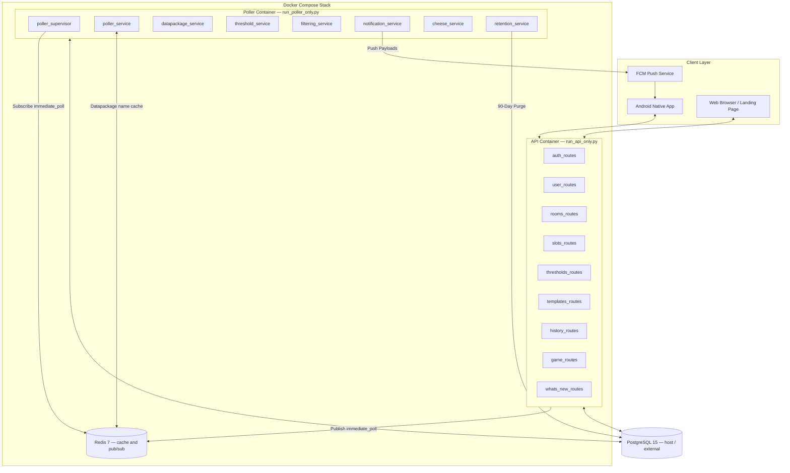

# Archipelago Alerts — System Architecture Document

## 1. System Overview

**Archipelago Alerts** (AP Tracker) is a multi-user tracking and notification system designed for [Archipelago Multiworld](https://archipelago.gg/) async games. It enables thousands of active players to track room states, monitor items received by specific player slots, receive instant FCM push notifications for milestone threshold groups, and sync seamlessly with external tools like Cheese Tracker.



Both containers build from the same image and both call `create_app()`, so they share configuration, model definitions, and the startup migration step. Local development can instead run `backend/run.py`, which serves the API on a thread and runs the poller in the main process.

---

## 2. Component Architecture

### A. Modular API Server (`backend/app/routes/`)
The authenticated REST API is decomposed into 9 domain-driven Flask blueprints, registered through `api.register_api_routes(app)`:
* **[auth_routes.py](backend/app/routes/auth_routes.py):** Session invalidation, JWT token blocklisting, public server config (`/logout`, `/config`).
* **[user_routes.py](backend/app/routes/user_routes.py):** User profiles, FCM device registration, global notification preferences, account deletion.
* **[rooms_routes.py](backend/app/routes/rooms_routes.py):** Room tracking CRUD, room revival, player list resolution, datapackage endpoints.
* **[slots_routes.py](backend/app/routes/slots_routes.py):** Tracked slot preferences, ignore/whitelist lists, snooze timers.
* **[thresholds_routes.py](backend/app/routes/thresholds_routes.py):** Milestone threshold group CRUD. `GET` returns an `acquired` count per requirement, read from `SlotItemCount`, so item-group requirements report real progress the client cannot compute locally.
* **[templates_routes.py](backend/app/routes/templates_routes.py):** Milestone template CRUD, backing the template picker and export/import.
* **[history_routes.py](backend/app/routes/history_routes.py):** Item and hint feeds, delta history synchronization (`POST /history/sync`).
* **[game_routes.py](backend/app/routes/game_routes.py):** Game item & location datapackage inspection.
* **[whats_new_routes.py](backend/app/routes/whats_new_routes.py):** Serves `GET /api/whats_new` from `app/data/changelog.json`.

Four more blueprints are registered directly in `create_app()`:
* **[auth.py](backend/app/auth.py):** Discord OAuth2 callback, guest account creation, and guest-to-Discord upgrade.
* **[api_cheese.py](backend/app/api_cheese.py):** Cheese Tracker integration, mounted at `/integrations/cheese`.
* **[api_public.py](backend/app/api_public.py):** Unauthenticated `/api/public/stats`.
* **[main.py](backend/app/main.py):** Landing page, privacy policy, and the web account-deletion flow.

### B. Redis Event Queue & Cache Layer (`backend/app/services/redis_service.py`)
* **Pub/Sub Event Bus (`immediate_poll` channel):** The API publishes a room id the moment a user adds or revives a room; the poller container is subscribed and acts on it without waiting for the supervisor tick. If Redis is unavailable, `immediate_poll_checker` degrades to a 10-second poll of the `needs_immediate_poll` column, so the feature never hard-fails on a missing Redis.
* **Entity Name Caching:** Resolves item and location names in-memory (`dp:<checksum>:<entity_type>:<id>`, 7-day TTL), bypassing repetitive SQL joins.
* **Protocol Compatibility:** Includes dual-handshake support (RESP3 with automatic RESP2 fallback for older Redis/Windows builds), then an in-memory fallback if neither connects.

### C. Modular Poller Engine (`backend/app/services/`)
The poller handles background polling and event detection across active Archipelago multiworld rooms:
* **[poller_service.py](backend/app/services/poller_service.py):** Stateless HTTP GET polling using `/api/room_status/<uuid>` gatekeepers to skip redundant tracker downloads.
* **[threshold_service.py](backend/app/services/threshold_service.py):** Evaluates AND-logic milestone threshold groups for tracked slots.
* **[filtering_service.py](backend/app/services/filtering_service.py):** Resolves ignore and whitelist rules server-side, expanding item-group rules against the exact datapackage checksum an item arrived under.
* **[notification_service.py](backend/app/services/notification_service.py):** Aggregates and dispatches FCM push payloads, including the Android channel id and priority for each event category.
* **[cheese_service.py](backend/app/services/cheese_service.py):** Handles Cheese Tracker background sync and grace-period unclaim logic.
* **[datapackage_service.py](backend/app/services/datapackage_service.py):** Datapackage caching, healing, and group name expansion.
* **[retention_service.py](backend/app/services/retention_service.py):** Runs automated 90-day retention purges for event logs and inactive guest accounts, plus expiry of the JWT blocklist.

The supervisor (`poller.py::poller_supervisor`) runs on a 60-second tick: it queues new rooms for setup with backoff on repeated failures, revives suspended rooms, suspends active rooms that have gone quiet, deletes rooms with no subscribers, and starts a separate Cheese poller task per room that needs one.

---

## 3. Database & Optimization Strategy

### Primary Storage: PostgreSQL 15
SQLite is supported for local development only, where `create_app()` builds the schema straight from the models.

* **Composite and supporting indexes:**
  - `ix_usertrackedslot_user_room`: `(user_id, room_id)`
  - `ix_notifieditem_room_receiving_time`: `(room_id, receiving_slot_id, timestamp)`
  - `ix_notifiedhint_room_owner_time`: `(room_id, item_owner_id, timestamp)`
  - `ix_notifieditem_timestamp` / `ix_notifiedhint_timestamp`: single-column timestamp indexes serving the retention purge and cross-room feeds.
* **`SlotItemCount`** (`room_id`, `slot_id`, `item_id`, `count`, uniquely constrained together) is the poller's running per-slot tally. It is the authority for milestone progress: unlike client history it survives the retention window and is unaffected by ignore rules, and it is the only source that can count an item-group requirement.
* **90-Day Retention Window:**
  - `NotifiedItem` and `NotifiedHint` records older than 90 days are purged automatically to maintain small database size and sub-millisecond query performance.
  - Guest accounts inactive for more than 90 days are cleaned up.
  - Expired `JWTBlocklist` entries are dropped once the tokens they revoke have expired on their own.

### Startup Migrations (`backend/app/db_migrations.py`)
Postgres schema upgrades are applied on startup rather than by hand. Every entrypoint reaches `create_app()`, which calls `upgrade_to_head(engine)`:
* A `pg_advisory_lock` on a fixed key serializes the API and poller containers, which start concurrently and would otherwise race.
* Overlapping heads in `alembic_version` are reconciled first — any version that is an ancestor of another present version is removed, which happens when branches are linearized after being applied.
* The module locates `alembic.ini` across both layouts it runs in: `/app/alembic.ini` in the container (where `backend/` is copied to `/app`) and `<root>/alembic.ini` in a checkout.

`alembic upgrade heads` still works for applying migrations manually.

---

## 4. Containerization & Deployment

### Production Deployment (`docker-compose.yml`)
Deployed on a Google Cloud VM via Docker Compose:
* **`redis`**: Redis 7 container with persistent volume `redisdata`.
* **`api`**: Flask API container running `run_api_only.py` under Waitress, capped at 1 CPU / 1 GB.
* **`poller`**: Worker container running `run_poller_only.py`, capped at 1.5 CPU / 3 GB.

PostgreSQL is **not** part of the production stack. It runs outside Compose and is reached over `host.docker.internal` (mapped to the host gateway), so `DATABASE_URL` in `backend/.env` points at the host rather than at a service name. Both containers mount `alembic/` and `alembic.ini` so the startup migration has its scripts.

### Local Development (`docker-compose.dev.yml`)
Adds a `postgres` service (PostgreSQL 15, `pgdata_dev` volume) alongside Redis, publishes both ports to the host, and bind-mounts `backend/app` into the running image so backend edits take effect without a rebuild.

```bash
docker-compose -f docker-compose.dev.yml up -d
```

To run the Python process on the host instead, bring up only the datastores and start the combined API + poller entrypoint:

```bash
python backend/run.py
```
